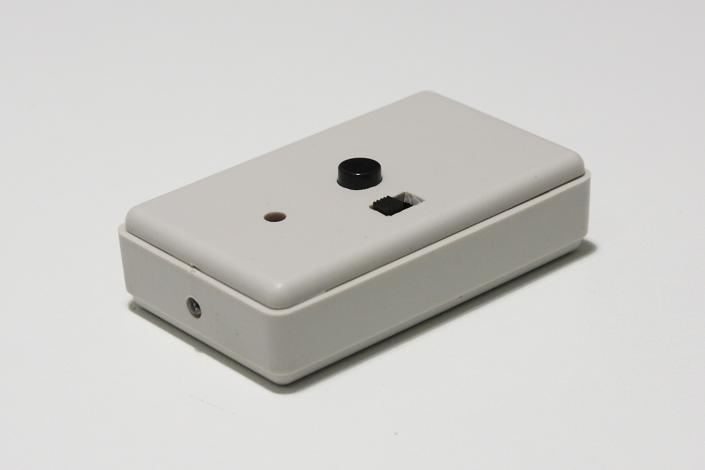
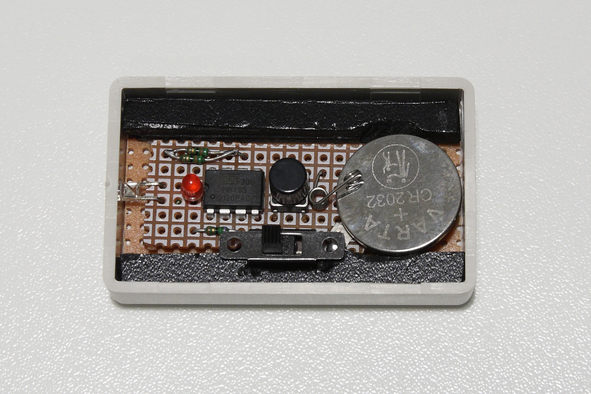

# Arduino_Canon_IR
Remote Infra Red control for Canon cameras, compatible with RC-6. 
Implemented with ATTiny85 microcontroller and Arduino IDE.

 

# How it works
The remote control communicates with the camera through infra red pulses. Two modes of operation are available: one triggers immediately the camera shutter and the other, called delayed mode, triggers the camera after 2 seconds from the command. A good reverse engineering of the RC-1 remote control (now replaced by the RC-6 model) can be found [here](https://www.doc-diy.net/photo/rc-1_hacked/).

Basically the protocol consist in two bursts of 16 infra red pulses at 32700 Hz, separated by a time interval of 5.36 msec for the delayed mode and 7.33 msec for the immediate trigger. 

# Build Instructions

## Components
1. 1x 3mm Infra Red LED
2. 1x 3mm red LED
3. 1x ATTiny85 microcontroller
4. 1x push button
5. 1x two position switch
6. 1x 3V coin battery CR2032 and a battery holder
7. 1x R
8. An Arduino board used as chip programmer

## Circuit diagram

# License
This program is licensed under MIT.

