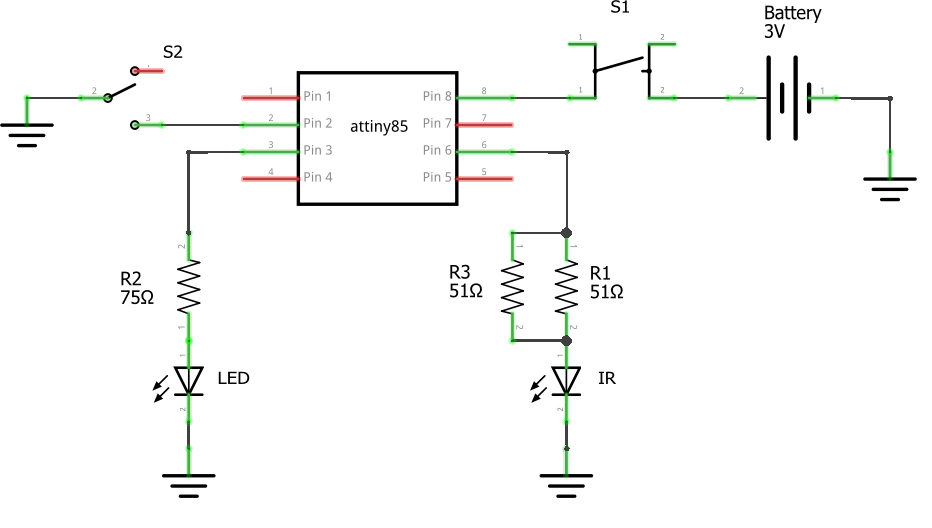

# Arduino_Canon_IR
Remote Infra Red control for Canon cameras, compatible with RC-6. 
Implemented with ATTiny85 microcontroller and Arduino IDE.

 

# How it works
The remote control communicates with the camera through infra red pulses. Two modes of operation are available: one triggers immediately the camera shutter and the other, called delayed mode, triggers the camera after 2 seconds from the command. A good reverse engineering of the RC-1 remote control (now replaced by the RC-6 model) can be found [here](https://www.doc-diy.net/photo/rc-1_hacked/).

Basically the protocol consist in two bursts of 16 infra red pulses at 32700 Hz, separated by a time interval of 5.36 msec for the delayed mode and 7.33 msec for the immediate trigger. 

# Build Instructions

## Components
1. 1x 3mm Infra Red LED
2. 1x 3mm red LED
3. 1x ATTiny85 microcontroller
4. 1x push button
5. 1x two position switch
6. 1x 3V coin battery CR2032 and a battery holder
7. 1x 75 ohm resistor
8. 2x 51 ohm resistors
9. 1x Arduino Nano board used as chip programmer

## Circuit diagram
 

## How to program ATTiny with an Arduino Nano as ISP programmer
1. Place the Arduino Nano on a breadboard, connect it to a USB port of the PC and run the Arduino IDE
2. In the Arduino IDE open the sketch `File->Examples->ArduinoISP` and upload to the board. If you encounter the error avrdude: **ser_open(): can't set com-state for "\\.\COM4"**, try to update the CH340 serial driver from the [manufacturer site](https://www.wch-ic.com/search?t=all&q=CH340) or try an older version of the driver from 
   [Sparkfun](https://learn.sparkfun.com/tutorials/how-to-install-ch340-drivers/all#drivers-if-you-need-them)
3. Disconnect the Arduino Nano from USB and do the following connections on the breadboard:

| ATTiny  | Nano |
| ------- | ---- |
| pin 1  | pin D10 |
| pin 4  | GND     |
| pin 5  | pin D11 |
| pin 6  | pin D12 |
| pin 7  | pin D13 |
| pin 8  | +5V     |

 

4. Reconnect the Arduino Nano to USB port of the PC
5. Open the sketch you to upload on the ATTiny85 and select the following in the IDE `Tools` menu:
   - Board: ATTiny25/45/85
   - Processor: ATTiny85
   - Clock: Internal 1 MHz
   - Programmer: Arduino as ISP
6. On the IDE run `Tools->Burn Bootloader` and `Sketch->Upload Using Programmer`

# License
This program is licensed under MIT.

